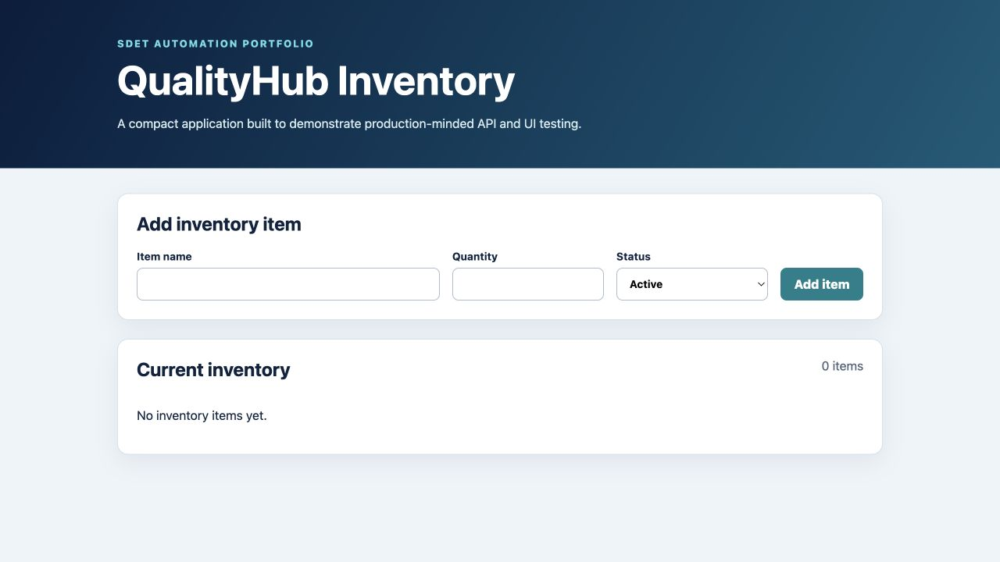

# QualityHub — SDET Automation Portfolio

QualityHub is a self-contained quality-engineering portfolio project demonstrating how I design test strategy and automation across API, UI, CI/CD, containerized, and performance-testing layers.

> This is an independent personal project. It contains no employer source code, customer data, proprietary endpoints, or confidential implementation details.



## What this project demonstrates

- Python test automation with `pytest`
- REST API testing for positive, negative, boundary, and data-driven scenarios
- Selenium UI automation using the Page Object Model
- Reliable test isolation with temporary SQLite databases
- CI quality gates and downloadable test evidence in GitHub Actions
- Dockerized application execution
- Load-test modeling with Locust
- Clear defect-prevention checks, meaningful assertions, and maintainable test structure

## System under test

QualityHub is a small Flask inventory service with:

- a health endpoint;
- CRUD-style inventory APIs;
- input validation and meaningful HTTP status codes;
- a responsive browser interface;
- persistent SQLite storage.

```text
Browser UI ───────┐
                  ├── Flask application ── SQLite
REST API clients ─┘
       ▲
       ├── Pytest API suite
       ├── Selenium Page Objects
       ├── GitHub Actions quality gate
       └── Locust performance model
```

## Repository structure

```text
app/                    Flask application and UI
tests/api/              API and negative-path tests
tests/ui/               Selenium tests and page objects
performance/            Locust workload model
.github/workflows/      CI quality gate
Dockerfile              Container image
docker-compose.yml      Local container execution
```

## Quick start

Create a virtual environment and install dependencies:

```bash
python3 -m venv .venv
source .venv/bin/activate
pip install -r requirements-dev.txt
```

Start the application:

```bash
python run.py
```

Open `http://127.0.0.1:5000`.

## Run the automated tests

API and service tests:

```bash
pytest -m "not ui"
```

Selenium tests in headless Chrome:

```bash
pytest -m ui
```

All tests:

```bash
pytest
```

Generate local coverage and HTML evidence:

```bash
mkdir -p reports
pytest -m "not ui" \
  --cov=app \
  --cov-report=term-missing \
  --cov-report=html:reports/coverage \
  --html=reports/api-tests.html \
  --self-contained-html
```

## Run with Docker

```bash
docker compose up --build
```

## Performance test

Start QualityHub, then run:

```bash
locust -f performance/locustfile.py --host http://127.0.0.1:5000
```

For a short headless check:

```bash
locust -f performance/locustfile.py \
  --host http://127.0.0.1:5000 \
  --headless \
  --users 10 \
  --spawn-rate 2 \
  --run-time 30s
```

## Test strategy

| Layer | Primary risks | Coverage |
|---|---|---|
| API | invalid contracts, incorrect status codes, persistence errors | happy paths, negative inputs, retrieval, listing, deletion |
| UI | broken critical journey, incorrect form wiring | active and discontinued inventory creation |
| Integration | app/database behavior | isolated SQLite database per test |
| Performance | read/write degradation under concurrency | weighted browse/create workload |
| CI/CD | regressions reaching the main branch | API coverage, headless UI suite, evidence artifacts |

## Deliberate engineering decisions

- The application is local and self-contained so the test suite does not depend on an unreliable public demo system.
- API tests use Flask's test client for deterministic feedback, while UI tests exercise the running service through a real browser.
- UI locators prioritize stable IDs and test-specific attributes instead of brittle visual selectors.
- Each test receives an isolated database to prevent order dependence and data leakage.
- Negative tests assert both HTTP status and actionable validation messages.

## Future improvements

- JSON Schema contract validation
- Authentication and role-based authorization tests
- Parallel execution and retry analytics
- Contract testing for downstream consumers
- Performance thresholds enforced in CI
- Accessibility checks

## Verification snapshot

- 12 automated tests
- API, negative-path, and browser coverage
- 93% application-code coverage in the latest local run
- Selenium journeys verified in headless Firefox
- GitHub Actions configured to execute API and Chrome UI suites

